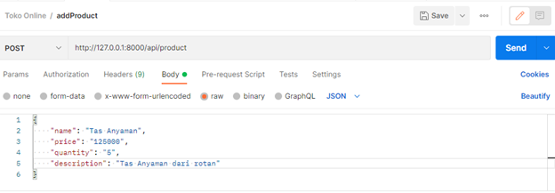
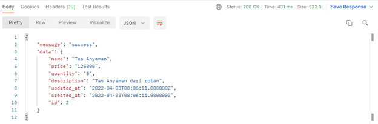
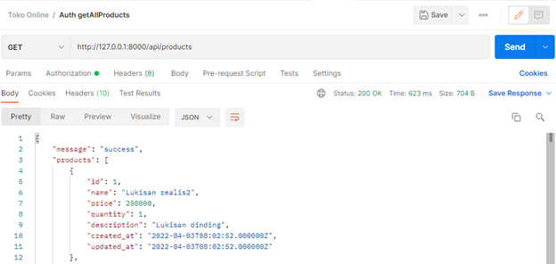
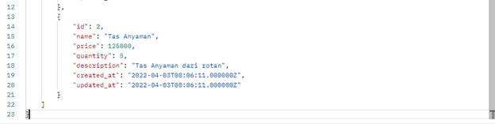
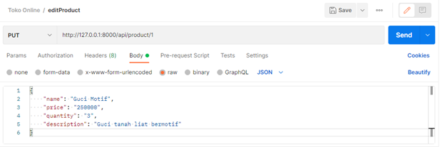
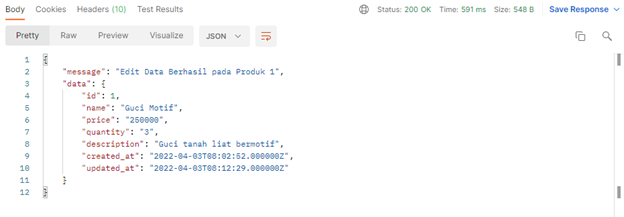
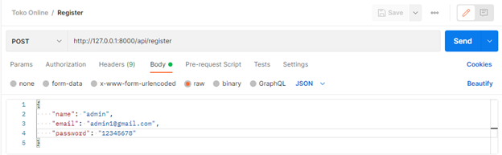
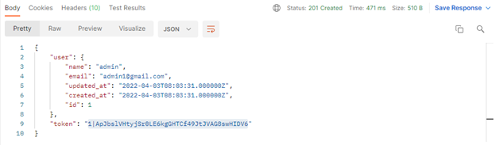
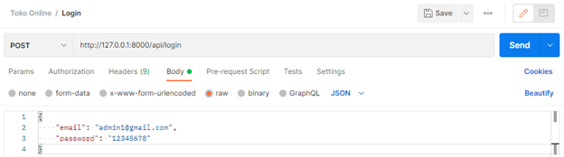
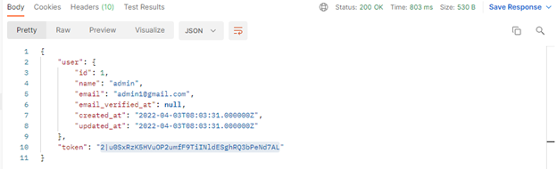

# API Spec

## Add Product

Request :

- Method : POST
- Endpoint : `/api/product`
- Header :
    - Content-Type: application/json
    - Accept: application/json
- Body :

Response :

## Get All Products

Request :
- Method : GET
- Endpoint : `/api/products`
- Header :
    - Accept: application/json

Response :

## Edit Product

Request :
- Method : PUT
- Endpoint : `/api/product/{id}`
- Header :
    - Content-Type: application/json
    - Accept: application/json
- Body :

Response :

## Delete Product

Request :
- Method : DELETE
- Endpoint : `/api/product/{id}`
- Header :
    - Accept: application/json

Response :

# Authentication

Request :
- Header :
    - Accept: application/json
- Authorization :
    - Type : Bearer Token

## Register
Request :

- Method : POST
- Endpoint : `/api/register`
- Header :
    - Accept: application/json
- Body :

Response :

## Login
Request :

- Method : POST
- Endpoint : `/api/login`
- Header :
    - Accept: application/json
- Body :

Response :

## License

The Laravel framework is open-sourced software licensed under the [MIT license](https://opensource.org/licenses/MIT).
